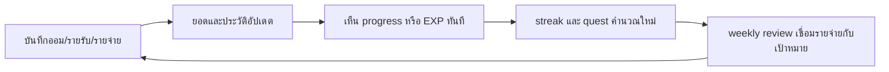

# ภาพรวมผลิตภัณฑ์และฟีเจอร์

## ผลิตภัณฑ์คืออะไร

KeepKapook เป็นเครื่องมือสร้างนิสัยการบันทึกและตั้งเป้าการออมสำหรับผู้ใช้ไทย แอปเชื่อม “สิ่งที่จ่ายไป” กับ “เป้าหมายที่อยากได้” ผ่านกระปุกออม, รายรับรายจ่าย, streak, EXP และ weekly review แต่ไม่เชื่อมบัญชีธนาคาร ไม่รับฝากเงิน และไม่ล็อกเงินจริง

ข้อความกำกับนี้แสดงก่อนเริ่ม onboarding, ใน Settings และบน action ที่เสี่ยงต่อการเข้าใจผิด เช่น โอน, ถอน, ล็อก และแชร์กระปุก

## วงจรใช้งานหลัก

## ฟีเจอร์สำหรับผู้ใช้

### กระปุกและเป้าหมาย

- สร้างเป้าหมายแบบมียอดเป้า วันเป้าหมาย หมวด ความสำคัญ emoji และสี
- สร้าง Cloud Pocket แบบ flexible ซึ่งรับยอดได้ไม่จำกัดและไม่แสดงเปอร์เซ็นต์
- ฝากเงินเข้ากระปุก; goal ปกติรับถึงยอดเป้าและส่งส่วนเกินไป “ยังไม่จัดสรร”
- จัดสรรยอดที่ยังไม่จัดสรรเข้ากระปุก
- โอนระหว่างกระปุกด้วย source/destination ID จริง
- ถอนออกจากระบบ หรือถอนกลับไปยอดยังไม่จัดสรร
- ล็อก 7/30/90 วันในฐานะการเตือนใจ ไม่ใช่ล็อกเงินจริง และยกเลิกได้
- แชร์/ออมด้วยกันเป็นข้อมูลจำลองในเครื่อง
- celebration เมื่อถึงเป้าหมาย พร้อมเสนอเป้าหมายถัดไปและปุ่ม “ไว้ก่อน”

### รายรับรายจ่าย

- เพิ่มรายรับหรือรายจ่ายพร้อมจำนวน หมวด note และวัน
- แสดงรายรับ รายจ่าย และ “ยอดสุทธิจากรายการที่บันทึก” รายเดือน
- แก้ไขและลบย้อนหลังได้
- quick expense จำหมวดล่าสุด
- parser ภาษาไทยรับข้อความสั้น เช่น `ข้าวขาหมู 150` แล้วจำแนกจำนวน ประเภท หมวด และวันที่

### บันทึกเร็ว

- เปิดจาก FAB หรือ dashboard โดยไม่ต้องเปลี่ยนแท็บ
- ปุ่มออมเริ่มต้น 20/50/100 บาท แก้ได้ใน Settings
- มีกระปุกเดียวเลือกให้ทันที; หลายกระปุกเลือกใน bottom sheet เดิม
- ทุกบันทึกมี undo 5 วินาที โดยคืน state ทั้งก้อน
- conversational entry ใช้ tier: high บันทึกทันที, medium บันทึกพร้อม chip แก้ไข, low ถามหนึ่งคำถาม, reject ไม่บันทึก

### Habit และ gamification

- streak คำนวณจาก timestamp รายการจริงตามวันไทย
- ขาดหนึ่งวันอยู่ในช่วงผ่อนผัน; ขาดสองวันติด streak ปัจจุบันเริ่มใหม่
- แสดงปฏิทินกิจกรรมรายเดือนและ streak ยาวที่สุด
- EXP จาก external inflow และ milestone ของ goal เท่านั้น; การย้ายเงินภายในไม่ให้ EXP
- quest และ badge มี handler ครบตาม invariant I11
- ของที่ปลดล็อกแล้วไม่ถูกริบย้อนหลัง

### Weekly review

- first-week review เปิดหลังครบวันที่ 7 จากการใช้งานครั้งแรก
- weekly review ปกติอ้างสัปดาห์จันทร์–อาทิตย์ และดูย้อนหลังได้
- แสดงวันบันทึก, streak, ยอดออมเข้าเป้า, รายจ่าย, เทียบสัปดาห์ก่อน, หมวดสูงสุด และ projection เป้าหมาย
- ตัวเชื่อมรายจ่าย → เป้าหมายใช้เฉพาะส่วนต่างที่สังเกตจริง ไม่สร้างเลขสมมติ
- ไม่สรุปแนวโน้มจากข้อมูลน้อยกว่า 2 วัน

### Notification

- local notification รายวัน ค่าเริ่มต้น 20:00
- weekly review เช้าวันจันทร์ ค่าเริ่มต้น 09:00
- ขอ permission หลังบันทึกรายการแรกและหลังหน้าต่าง undo เท่านั้น
- ปฏิเสธแล้วไม่ถามซ้ำ
- web ใช้ stub และซ่อนเมนูที่ทำงานไม่ได้

### ข้อมูลและความเป็นส่วนตัว

- state อยู่บนอุปกรณ์ผ่าน `shared_preferences`
- export/import เป็น JSON โดยผู้ใช้เลือกไฟล์และแชร์เอง
- import ผ่าน validation และ migration, แสดง preview และถามก่อนเขียนทับ
- สำรอง state ปัจจุบันก่อน import และเก็บ corrupt backup เมื่อโหลดไม่ได้
- local metrics เก็บตัวนับและวันที่ ไม่เก็บยอดเงินราย event
- corpus parser เก็บได้เฉพาะข้อความ low/reject หรือข้อความที่ถูกแก้ และปิดได้ใน Settings

