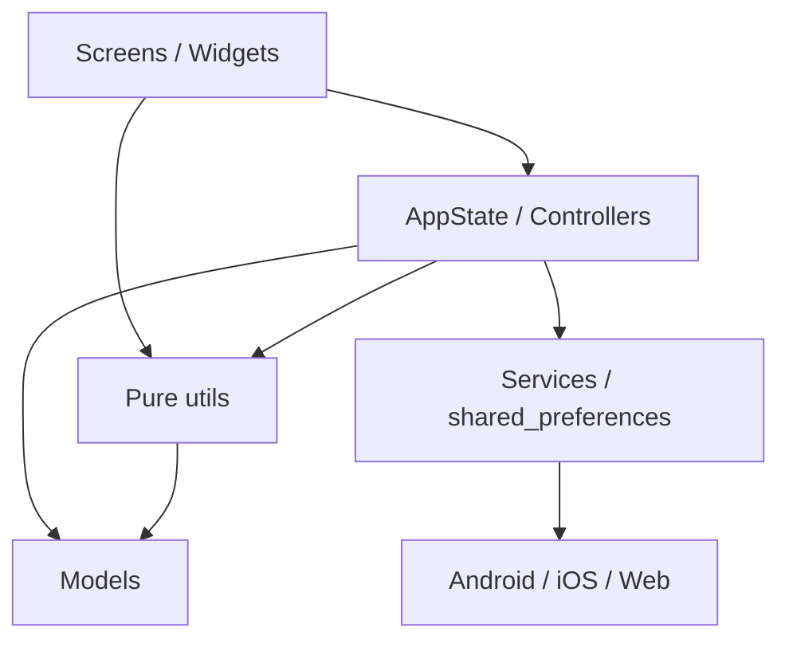

# สถาปัตยกรรมและวงจรการทำงาน

## Technology stack

| ส่วน | เทคโนโลยี |
|---|---|
| UI | Flutter Material 3 |
| State | `provider` + `ChangeNotifier` |
| Local persistence | `shared_preferences` |
| Chart | `fl_chart` |
| Format/locale | `intl`, ฟอนต์ Prompt ผ่าน `google_fonts` |
| ID | `uuid` |
| รูปสลิป | `image_picker` |
| Backup file | `file_selector`, `share_plus`, `package_info_plus` |
| Notification | `flutter_local_notifications`, `timezone` |

## โครงสร้าง source

```text
lib/
├── main.dart                 app bootstrap, providers, onboarding gate, tabs
├── models/                   entity และ JSON contract
├── state/                    AppState, mutation, validation, migration, backup
├── utils/                    pure domain functions
│   └── parser/               pure-Dart Thai parser
├── services/                 platform/persistence adapters
├── screens/                  หน้าจอระดับ route/tab
├── widgets/                  UI ที่ใช้ซ้ำและ bottom sheets
└── theme/                    สีและ ThemeData
```

## Dependency direction



กฎสำคัญคือ logic ใหม่ต้องอยู่ใน pure function ภายใต้ `utils/` และรับเวลาเป็นพารามิเตอร์ ส่วน UI ทำหน้าที่วาดและส่ง action เข้าสู่ AppState/Controller

## การเริ่มแอป

`main()` สร้าง provider สามตัวพร้อมกัน:

1. `AppState()..load()` โหลดและ migrate state หลัก
2. `NotificationController()..load()` เตรียม notification โดยยังไม่ขอ permission
3. `QuickEntryController()..load()` โหลดชุดจำนวนด่วนและหมวดรายจ่ายล่าสุด

`KeepKapookApp` สร้าง `MaterialApp`; `HomeShell` ตัดสิน UI ตามลำดับ:

1. `AppState.loaded == false` → loading
2. `user.onboarded == false` → onboarding ที่ต้องเห็น disclaimer
3. onboarded → shell 5 tabs + FAB

หากโหลด state มีปัญหา `MaterialBanner` แสดงข้อความไทยและให้ผู้ใช้ปิดได้

## Navigation

Bottom navigation มี 5 แท็บ:

1. ภาพรวม (`DashboardScreen`)
2. กระปุก (`GoalsScreen`)
3. ภารกิจ (`QuestsScreen`)
4. ประวัติ (`HistoryScreen`)
5. ตั้งค่า (`SettingsScreen`)

หน้ารองใช้ `Navigator.push` เช่น รายละเอียด goal, ledger, weekly review, achievement, add saving, new goal และ scan slip ส่วน quick record/conversational entry ใช้ bottom sheet เพื่อไม่บังคับเปลี่ยนแท็บ

## State ownership

- `AppState`: user, goals, transactions, quests, badges, ledger, unallocated, metrics และ persistence หลัก
- `QuickEntryController`: จำนวนด่วนและหมวดรายจ่ายล่าสุด; persist แยกจาก state หลัก
- `NotificationController`: permission, enable flags, เวลา และ schedule; persist แยกจาก state หลัก

## เวลา

- เวลา domain ที่ต้องเทสใช้ seam `DateTime Function()` หรือรับ `now/asOf/referenceDate`
- ขอบเขตวันใช้ `bangkokLocalDay()` เพื่อยึด UTC+7 คงที่
- timestamp ใหม่บันทึกเป็น UTC
- legacy timestamp ที่ไม่มี timezone ถือเป็นเวลาไทย

## การแจ้ง UI หลัง mutation

AppState เปลี่ยน in-memory state, สร้าง snapshot JSON, จัดคิว save แบบ debounce 300 ms และเรียก `notifyListeners()`. Snapshot ถูกจับทันที ทำให้ลำดับ write ไม่ย้อนแม้ผู้ใช้กดเร็ว การเขียนผิดพลาดถูกเปิดเผยผ่าน `loadErrorMessage`

