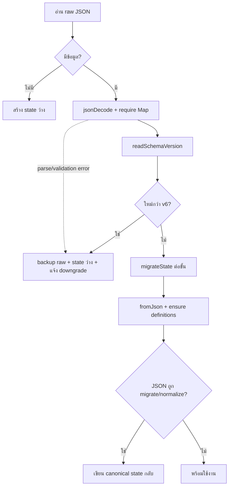

# Persistence, migration, backup และ recovery

## Storage หลัก

| รายการ | ค่า |
|---|---|
| state key | `keepkapook_state_v1` |
| corrupt backup | `keepkapook_state_v1_corrupt_backup` |
| pre-import backup | `keepkapook_state_v1_pre_import_backup` |
| schema ปัจจุบัน | 6 |

ชื่อ key ยังคงลงท้าย `_v1` เพื่อ compatibility แต่ version ของรูป JSON อ่านจาก `schemaVersion`

## รูป JSON ระดับบน

```json
{
  "schemaVersion": 6,
  "user": { "name": "...", "exp": 120, "onboarded": true },
  "goals": [],
  "transactions": [],
  "quests": [],
  "badges": [],
  "ledger": [],
  "unallocatedSatang": 0,
  "metrics": {}
}
```

## Load pipeline



ข้อมูลไม่มี `schemaVersion` ถือเป็น v1. โหลดผิดพลาดไม่ crash และไม่ล้างเงียบ: raw เดิมถูกเก็บไว้ใน corrupt backup พร้อมข้อความไทยที่สังเกตได้

## Save pipeline

1. `toJson()` สร้าง snapshot ณ เวลา mutation
2. debounce ประมาณ 300 ms เพื่อรวมการกดถี่
3. คิวรับประกัน write ทีละก้อนตามลำดับ
4. เขียนผ่าน injected `stateWriter` ในเทส หรือ `SharedPreferences.setString`
5. หากล้มเหลว ตั้งข้อความ error และ notify; ไม่กลืน exception แบบไร้ร่องรอย

## Migration chain

| ขั้น | การเปลี่ยนแปลง |
|---|---|
| v1 → v2 | แปลงเงิน legacy แบบ `double` บาทเป็น `int` สตางค์, rename field เป็นชื่อ `...Satang`, ปัดครึ่งขึ้น |
| v2 → v3 | เพิ่ม `flow` และ `destinationGoalId`; transfer เก่ากู้ปลายทางจาก note เฉพาะชื่อที่ตรง goal หนึ่งเดียว |
| v3 → v4 | canonicalize `TxType ↔ flow`; เพิ่ม `highestMilestonePercent` จากยอด/EXP เดิม |
| v4 → v5 | เพิ่ม snapshot ชื่อ source/destination; กรอง quest/badge ที่เลิกใช้โดยรักษา badge เก่าที่ unlock แล้ว |
| v5 → v6 | เพิ่ม `LocalMetrics` จาก timestamp และรายการเดิมโดยไม่สร้าง event ที่มีจำนวนเงิน |

`migrateState()` ใช้ map ของ step function และวนทีละ version; ไม่มี if-else ก้อนเดียว. เวอร์ชันใหม่กว่าโยน `UnsupportedSchemaVersionException`; ถ้าขาดขั้นโยน `MissingMigrationException`

## กฎแปลงเงิน v1

แปลงบาทเป็นสตางค์ด้วย half-up แบบจำนวนเต็ม/ข้อความ ห้ามผ่าน binary floating point เพิ่มเติม ตัวอย่าง `1500.005` บาทต้องปัดตามกฎเดียวเป็นจำนวนสตางค์ที่แน่นอน

## Backup export

`createBackupJson()` ห่อ state ด้วย metadata ของไฟล์ KeepKapook ได้แก่ schema version, เวลา export และเวอร์ชันแอป. ชื่อไฟล์ `keepkapook-backup-YYYYMMDD.json`

`BackupFileService.shareBackup()` สร้าง JSON file ใน memory แล้วเปิด native share/save sheet; ไม่มี upload server

## Import validation

`validateBackupJson(raw)` ตรวจตามลำดับ:

- JSON parse ได้และ root เป็น object
- เป็น backup ของ KeepKapook และ metadata ครบ
- schema ไม่ใหม่กว่าแอป
- state migrate ถึง current schema ได้
- model list และ field สำคัญ hydrate ได้
- สร้าง `BackupPreview`: จำนวนกระปุก, จำนวนรายการ, ยอดรวม และวันที่สำรอง

ก่อน replace state แอปบันทึก pre-import backup เสมอ จากนั้น UI แสดง preview และถามยืนยันว่าจะเขียนทับ หากเขียนใหม่ล้มเหลวจะ restore state ก่อน import

## Fixture policy

มี fixture จริงของ schema v1, v2, v3, v4 และ v5 ใต้ `test/fixtures/schema/`. I14 migrate ทุก fixture ถึง v6, ตรวจ goal/transaction/EXP/badge และยืนยัน TOTAL ก่อน/หลังเท่ากัน เมื่อ bump schema ต้องเพิ่ม fixture ของ version ก่อนหน้าทุกครั้ง

