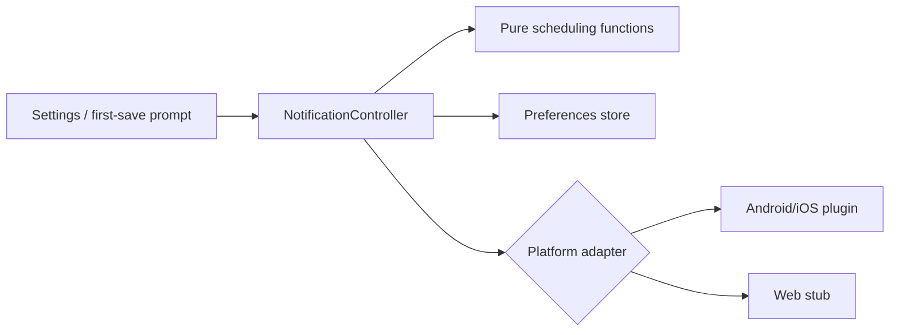

# Service, notification และความต่างระหว่าง platform

## Quick entry preferences

`QuickEntryController` โหลด/แก้ preference และ rollback ค่าเดิมเมื่อ persist ไม่สำเร็จ

| Key | ค่า |
|---|---|
| `keepkapook_quick_saving_amounts_satang` | String list ของจำนวนสตางค์ 3 ค่า |
| `keepkapook_quick_expense_category` | หมวดรายจ่ายล่าสุด |

ค่าเริ่มต้นคือ 20/50/100 บาทและหมวด `อาหาร`. `validQuickSavingAmountsOrDefault` กันค่าไม่ครบ, ซ้ำ, ไม่บวก หรือเกินเพดาน

## Notification architecture

`NotificationController` มี `load`, accept/decline permission, เปิดปิดรายวัน/weekly, เปลี่ยนเวลา และ refresh schedule. ทุก exception แปลงเป็นข้อความไทยโดยไม่กระทบการบันทึกหลัก

Preference keys:

- `keepkapook_notification_daily_enabled`
- `keepkapook_notification_weekly_enabled`
- `keepkapook_notification_daily_hour/minute`
- `keepkapook_notification_weekly_hour/minute`
- `keepkapook_notification_permission_prompt_handled`
- `keepkapook_notification_permission_granted`

Permission prompt ถูกจำถาวรเพื่อไม่ถามซ้ำหลังปฏิเสธ

## Pure schedule

- `nextDailyReminder`: เวลาไทยถัดไปตาม hour/minute; ถ้าผ่านแล้วเลื่อนไปวันถัดไป
- `nextWeeklyMondayReminder`: จันทร์ถัดไปหรือวันนี้ถ้ายังไม่ถึงเวลา
- `buildReminderPlans`: อย่างมากหนึ่ง plan ต่อประเภท
- `selectReminderGoalName`: เลือกชื่อ goal ที่ใช้ได้เพื่อทำข้อความเฉพาะบุคคล

Notification ID คงที่ทำให้การอัปเดตแทน schedule เก่า ไม่สะสมหลายรายการ

## Android/iOS adapter

`MobileLocalNotificationPlatform`:

- รองรับเฉพาะ Android/iOS
- initialize timezone `Asia/Bangkok`
- Android channel `habit_reminders`
- Android ใช้ inexact while idle
- iOS ไม่ขอ permission ตอน initialize; ขอเมื่อ controller สั่งเท่านั้น
- repeat รายวันหรือ Monday+time ผ่าน `DateTimeComponents`

Android manifest มี `RECEIVE_BOOT_COMPLETED` และ receiver สำหรับ schedule หลัง reboot/update. iOS ขอ notification ผ่าน plugin และมีคำอธิบาย photo library ภาษาไทยสำหรับ image picker

## Web adapter

Conditional import เลือก `WebLocalNotificationStub`: `isSupported=false` และ method เป็น no-op. UI ซ่อน notification settings จึงไม่เกิดปุ่มที่กดแล้วไม่ทำงาน และ `flutter build web` ไม่พัง

## Backup file service

- `appVersion`: อ่าน package version/build
- `pickBackupJson`: file picker จำกัด JSON
- `shareBackup`: สร้าง `XFile` จาก bytes ใน memory แล้วเปิด share/save sheet พร้อม download fallback

ไฟล์ไม่ถูกส่งออกเอง; การแชร์เกิดจาก action ผู้ใช้เท่านั้น

## Slip image

`ScanSlipScreen` ใช้ `image_picker` เลือกรูป แต่ OCR ยังไม่มี ผู้ใช้กรอกยอด/ปลายทางและยืนยันเอง รูปไม่ถูก upload. บน iOS มี `NSPhotoLibraryUsageDescription`; Android ไม่ขอ storage permission กว้าง

## Platform status

| Platform | สถานะ |
|---|---|
| Android | build/signing และ local notification รองรับ |
| iOS | source/config รองรับ แต่ต้อง build/sign บน macOS + Xcode |
| Web | build ใน CI; notification ปิดผ่าน stub |
| Windows | Flutter platform มีได้ แต่ plugin symlink อาจต้อง Developer Mode; ไม่ใช่ release target หลัก |

