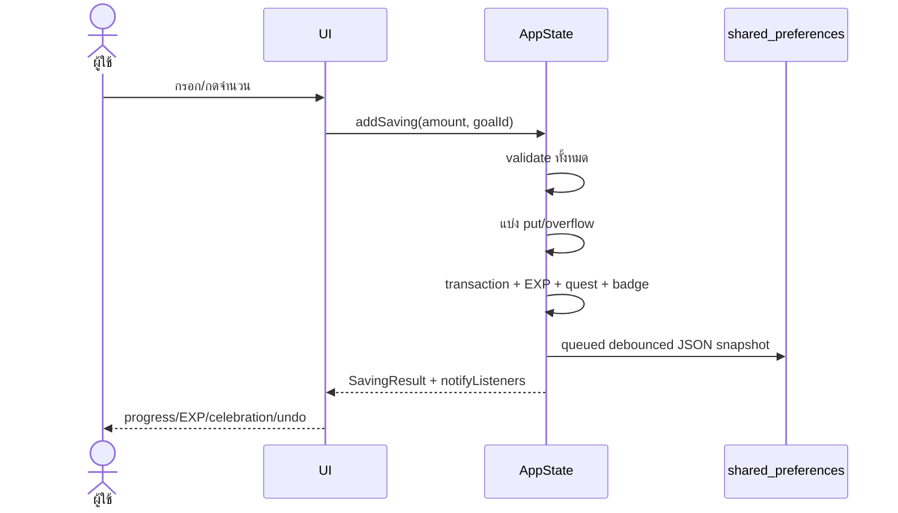

# Data flow แบบ end-to-end

## ฝากเงินเข้า goal

## Quick record + undo

Quick launcher ขอ snapshot ก่อน action. เมื่อ save สำเร็จ UI ได้ receipt และเปิด snackbar 5 วินาที หากกดยกเลิก `undoQuickRecord` restore JSON snapshot ทั้งก้อน จึงคืนยอด, unallocated, EXP, quest, badge, ledger, transaction และ metrics ที่เกี่ยวข้องพร้อมกัน

## Transfer

UI → validate amount/source/destination/self/lock → คำนวณยอดที่ย้ายได้ → ลด source → เพิ่ม destination → สร้าง internal transaction พร้อมสอง ID/snapshots → save. TOTAL ไม่เปลี่ยนและไม่มี EXP

## Parser entry

ข้อความ → normalize → detect amount/date/operator → classify → confidence/tier → UI policy. เฉพาะ high/medium หรือ low ที่ผู้ใช้ตอบชัดแล้วจึงแปลงเป็น AppState action; parser ไม่เรียก AppState เอง

## Weekly review

AppState แปลง Goal เป็น `WeeklyGoalInput` → pure period selector → financial/habit helpers → `WeeklyReport` → screen format ข้อความ. การเปิด report ส่ง action `completeWeeklyReview` เพื่อ progress quest และนับ metric แต่ตัวเลข report ไม่ persist เป็น snapshot

## Startup migration/recovery

Raw preference → decode → schema check → migration chain → hydrate model → ensure definitions → render. Failure/newer schema → backup raw → empty usable state + banner; ไม่มี crash/ล้างเงียบ

## Backup import

เลือกไฟล์ → validate metadata/schema/shape → migrate → preview → ผู้ใช้ยืนยัน → pre-import backup → replace state → flush save. หากเขียนไม่ได้ revert state ก่อน import

## Notification permission

App เริ่มโดยไม่ถาม → `recordSavedSerial` เปลี่ยนหลังบันทึกแรก → รอ 5 วินาทีเพื่อไม่ชน undo → dialog อธิบายบริบท → accept จึงเรียก system permission → schedule; decline จำไว้และไม่ถามซ้ำ

## Local metrics

Action reducer รับเฉพาะ kind/tier/date/counter และ optional parser text ที่ policy อนุญาต → update `LocalMetrics` immutable-style → รวมใน state JSON/export. ไม่มี background sender

